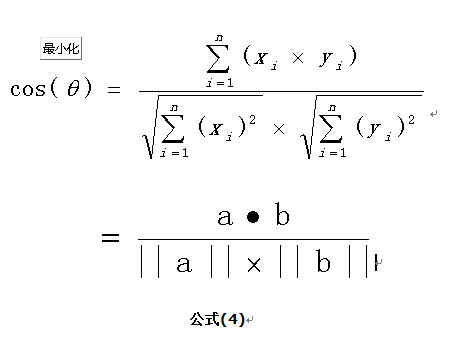

***

 *论文中应用各种解决方案时，比如说遗传算法，一般都需要根据实际的问题对其进行修改/定制化操作，不能够完全直接套用。*

**名词：解释（特点）。用法。**

* 超图：一条边可以连接无数点。一般用于将有关系的点放在一起，以对其进行管理和分析。

* 贝叶斯网络：有向无环的概率图模型，能够模拟因果关系，是一种不确定处理模型。一般可以用来做安全解决方案中的风险评估。

* NP问题: 可能性特别多(可能需要穷举)。一般可以将问题证明(已经有人推导)转化为NP(TSP问题)，然后提出方法(常见如异常算法等)近似对其求解。

* polynomial-time algorithm （P类问题）:时间复杂度是O(p(n))的算法称为多项式时间算法，这里p(n)是关于n的多项式。不能够这样限制时间复杂度的算法被称为指数时间算法。例如：时间复杂度为O(nlog(n))、O(n^3)的算法都是多项式时间算法，时间复杂度为O(n^log(n))、O(n!)、O(2^n)的算法是指时间算法。多项式时间可解问题就称为P类问题。

* 依赖图模型。分析各个节点之间的关系。一般用来验证实体相关性(是否有关系)，比如说利用其可以减小问题规模。

  > [维基百科-dependency graph](https://en.wikipedia.org/wiki/Dependency_graph)

* 在线算法：算法开始时不能知道所有输入，比如说是选择排序的思想，旅行者问题。

  > 其中涉及到了一个性能参数问题. Competitive analysis , —— [维基百科](https://en.wikipedia.org/wiki/Competitive_analysis_(online_algorithm))

* 离线算法：算法开始时知道所有输入，比如说是插入排序的思想，问题包括旅行中问题。

> * 假阳性错误，假设检验拒绝了实际成立的$\alpha$错误，即弃真。
> * 假阳性错误，假设检验承认了实际不成立的$\beta$错误。
>
> 一般在检测方法中，可以对提出的方法在这两个方面上进行验证，证明方法的合理性

* Network Calculus：分析计算机网络性能的理论框架。可以分析link capacity、traffic shapers (Leaky_bucket))、congestion control、background traffic对网络中流量的影响。或者通过对数据流建模，可以有效得到网络当前状态信息，如延迟、平均抖动和总吞吐量等。具体建模和方法见[维基百科](https://en.wikipedia.org/wiki/Network_calculus)，论文(包括了怎么使用)见[Mobility-Aware Flow-Table Implementation in Software-Defined IoT](http://ieeexplore.ieee.org/abstract/document/7841995/)。
* 自适应算法(Adaptive)：一种基于可用信息或先验定义的奖励机制（或标准）来改变其运行时的行为的算法。 信息包括最新接收到的数据，可用的计算资源，或其所运行的其他运行时的环境信息。[维基百科](https://en.wikipedia.org/wiki/Adaptive_algorithm)。
* **线性规划(LP)** ： 目标函数和约束条件皆为线性的最优化问题，能够应用于网络流，多商品流量等问题。很多最优化问题一般都要分解为线性规划子问题，然后逐一求解。形式化描述如下所示：

> [详细介绍](https://zh.wikipedia.org/wiki/%E7%BA%BF%E6%80%A7%E8%A7%84%E5%88%92)
>
> 求解方法：单纯形法(当线性方程组的变量数大于方程个数,基本思想：每一次比上一次更优，[详细介绍](https://www.hrwhisper.me/introduction-to-simplex-algorithm/))+大M法（线性规划问题的约束条件等式或大于型时，使用人工变量法后，寻找其初始基可行解的一种方法；即将有 if-then 结构的非线性约束线性化，会引入0-1变量）；两阶段法。
>
> 

* 非线性规划：目标函数和约束条件存在非线性（比如，二次）的最优化问题。场景：连续位置优化、成本非平滑变化（比如无源电路、石油产品运算）。一般求解求解方法：[维基]([https://zh.wikipedia.org/wiki/%E9%9D%9E%E7%BA%BF%E6%80%A7%E8%A7%84%E5%88%92](https://zh.wikipedia.org/wiki/非线性规划)); 常用解决方法：非线性最小二乘、一阶梯度和二阶梯度法、高斯牛顿法、LM算法。解决框架分为Line Search 和Trust Region两类-Line Search 先固定搜索方向，然后在该方向上寻找步长，以最速下降法和高斯牛顿法为代表。而Trust Region是先固定搜索区域，再考虑该区域里面的最优点，此类方法以LM算法为代表
* 整数规划Integer (linear) programming(ILP)，是一种数学优化模型，其中目标函数和约束条件的变量都是整数的线性优化问题，是NP-hard问题。可用于电信、蜂窝网络的网络优化，详细解释和常见解决方法见[维基百科](https://en.wikipedia.org/wiki/Integer_programming)，论文见[Bandwidth Calendaring: Dynamic Services Scheduling over Software Defined Networks](http://ieeexplore.ieee.org/abstract/document/7510888/)。

* 粒子群优化算法(PSO)：通过群体中个体之间的协作和信息共享来寻找最优解，实现简单，没有许多要调节的参数。广泛应用于函数优化、神经网络训练、模糊系统等**遗传算法**的应用领域。类似于GA(寻找最优解)。
  * [解释1](http://blog.csdn.net/myarrow/article/details/51507671)
  * [解释2](http://www.cnblogs.com/hxsyl/p/4521778.html)
  * [维基百科](https://zh.wikipedia.org/wiki/%E7%B2%92%E5%AD%90%E7%BE%A4%E4%BC%98%E5%8C%96)

* 遗传算法(genetic algorithm (GA))：是一种用于解决最优化的搜索算法，特别是*近似*全局最优化问题，比如时间表安排问题、分布式计算机网络的拓扑结构，计算平衡解决方案，求解一个函数的极值等。详见[维基百科](https://zh.wikipedia.org/wiki/%E9%81%97%E4%BC%A0%E7%AE%97%E6%B3%95)。像这样可以适应很多问题的算法还有*模拟退火算法*、*粒子群算法*、*蚁群算法*、*禁忌搜索*等等，统称为元启发式算法（Meta-heuristic algorithms)。[知乎的应用](https://www.zhihu.com/question/23293449)

* 多可行方案选择：使用投票机制(voting mechanism)来决定一个可用性最高的方案。

* 冲突解决方案：**满足大多数人的需求**的妥协方案。

* 启发式算法(heuristic algorithm)：相对于最优化算法。定义：一个基于直观或经验构造的算法，在可接受的花费（指计算时间和空间）下给出待解决组合优化问题每一个实例的一个可行解，该可行解与最优解的偏离程度一般不能被预计；启发式算法是一种**技术**，这种技术使得在可接受的计算成本内去搜寻最好的解，但不一定能保证所得的可行解和最优解，甚至在多数情况下，无法阐述所得解同最优解的近似程度。是一种根据经验规则进行发现的方法。常见的有:模拟退火算法(SA)、遗传算法(GA)、列表搜索算法(ST)、进化规划(EP)、进化策略(ES)、蚁群算法(ACA)、人工神经网络(ANN)和PSO。[具体解释1](http://www.cnblogs.com/sddai/p/5644011.html)，[维基百科](https://en.wikipedia.org/wiki/Heuristic_(computer_science))。其一般只能应用于特定领域的特定场合，不可跨应用。问题空间的特点：复杂、指数级规模、高维度、大空间、变化大、特征不易提取等。

  > 常用思路：将一个问题转化为形式化描述，然后进行转化成可以求解的问题(可选)，接着证明其是一个PNC问题，然后提出一个启发式算法(遗传、PSO常见)对其进行求解。

* order-k Marko模型：可以用来进行行为**预测** ，即根据之前得到的行为状态预测目标的下一个位置，具体方法见[Mobility-Aware Flow-Table Implementation in Software-Defined IoT](http://ieeexplore.ieee.org/abstract/document/7841995/)。进一步想，以预测的方式对问题进行解决，能够有效相关的耗损，提高反应速度。

* 基于微服务的框架(Microservices)：是SOA框架的一个变体，利用松散耦合的服务来构建应用，其中服务变得细粒度，协议要求是轻量级的。提供了程序的模块化，让应用更容易理解、开发和测试。这种思想(SOA)可以用在程序开发中，指出我们方法的“高大上”。详细解释见[维基百科](https://en.wikipedia.org/wiki/Microservices)。

* 列生成算法(colunm generation): 用来解决大型线性问题(NPC问题)。详细解释见[维基百科](https://en.wikipedia.org/wiki/Column_generation)，论文见[Bandwidth Calendaring: Dynamic Services Scheduling over Software Defined Networks](http://ieeexplore.ieee.org/abstract/document/7510888/)。

* 判断最合适的处理节点方法：计算、带宽、存储建造一个三维坐标，把任务需求和能提供能力的点在图中标示出来，选择欧式距离最小的来处理。

* structured overlays(结构化覆盖)：是一种建立在另一个网络上的网络，其中节点通过虚拟/逻辑链路进行连接，可能对应于物理上的多图链路，常见的如P2P，分布式系统等。技术上像是DHT的分发索引机制，可以用来确保高效的资源查找和搜索，应用包括索引、路由、存储、发布/订阅、组播和对等数据管理等。一般利用chord实现。定义见[维基百科](https://en.wikipedia.org/wiki/Overlay_network)。

* 蚁群算法(**A**nt **C**olony **O**ptimization, **ACO**)：用来在图中寻找优化路径的机率型算法(NP问题)。与遗传算法相比，ACO可以连续运行并适应实时变化的。遗传算法在种群进化的初期有着快速的全局搜索能力，而在后期搜索速度较慢。蚁群算法则是前期信息匮乏速度慢，后期则快速收敛。所以关于收敛速度的问题，很多学者将遗传算法和蚁群算法结合，通过遗传算法算子的选择、交叉、变异改进蚁群算法的参数。一般用来解决组合优化问题，形式化表达和应用见[维基百科](https://en.wikipedia.org/wiki/Ant_colony_optimization_algorithms)。

* 并行蚁群算法。提高算法运行效率，一般是在多蚁群在解的构造过程和信息素更新过程中共享同一个信息素矩阵。相关应用见论文[《蚁群算法并行化研究》](http://kns.cnki.net/KCMS/detail/detail.aspx?dbcode=CMFD&dbname=CMFD0506&filename=2005135600.nh&v=MTc5MjhiK2RtRnl2bVVMelBWMTI3RzdLN0c5Zk1yNUViUElSOGVYMUx1eFlTN0RoMVQzcVRyV00xRnJDVVJMMmY=)。

* 拉格朗日松弛：用在优化问题里面（假设是最小化问题），而且一定是有约束条件的优化问题，是一种求解约束规划的数学方法。简单来说就是发constraints弄到objective上面，加很大的penalty，大到满足这个constraint，就和原问题等价了，这样就变成没有约束条件的问题求解了。详细介绍见[维基百科](https://en.wikipedia.org/wiki/Lagrangian_relaxation)和[知乎](https://www.zhihu.com/question/21345731/answer/57182129)。把有约束优化问题转化成无约束优化问题。具体方法是**Augmented Lagrange Method增广拉格朗日乘子法** ，用来解决等式约束下的优化问题。另外还有**二次惩罚方法**， 详见[网址](http://blog.csdn.net/fangqingan_java/article/details/50001843).

* 置信空间confidence interval：一个概率样本的置信区间是对这个样本的某个总体参数的区间估计，其展现的是这个参数的真实值有一定概率落在测量结果的周围的程度。举例来说，如果在一次大选中某人的支持率为55%，而置信水平0.95上的置信区间是（50%,60%），那么他的真实支持率有百分之九十五的机率落在百分之五十和百分之六十之间，因此他的真实支持率不足一半的可能性小于百分之五。95%置信区间：当给出某个估计值的95%置信区间为【a,b】时，可以理解为我们有95%的信心可以说样本的平均值介于a到b之间，而发生错误的概率为5%。详细解释见[维基百科](https://en.wikipedia.org/wiki/Confidence_interval)。可以应用在论文中某个统计参数的定义。

* Pareto优化：用于资源分配或多目标优化场景(从此以后，非损人不能利己)。Matlab有工具箱，详细解释见[知乎](https://www.zhihu.com/question/22570835)和[百度](https://baike.baidu.com/item/Pareto%E6%9C%80%E4%BC%98%E8%A7%A3/5798765).

* ADMM(交替方向乘子法): 常见的约束问题最优化通用框架，适用于求解分布式凸优化问题，特别是统计学习问题。其通过分解协调（Decomposition-Coordination）过程，将大的全局问题分解为多个较小、较容易求解的局部子问题，并通过协调子问题的解而得到大的全局问题的解。关注点是**凸优化**和**分布式**。

* Variable Splitting(变量分裂法): 解决目标函数是两个函数之和的优化问题，[详细解释](http://blog.csdn.net/bingecuilab/article/details/47208895)。用法见论文《QoE and Power Efficiency Tradeoff for Fog Computing Networks with Fog Node Cooperation 》

* 切诺夫界Chernoff bound：可以有效地用于评估一个应用程序/算法的“鲁棒性水平”，通过随机化探索它的摄动空间。数学证明见[维基百科](https://en.wikipedia.org/wiki/Chernoff_bound)

* primal and dual原始对偶问题：用于问题优化，对偶问题为原问题提供了一个下界，primal和dual问题本来是会存在一个dual gap。如果有个比较强的约束条件（KTT）（when the problem is convex and satisfies ），那么dual gap=0.这叫做强对偶，那么就可以根据dual问题直接求得primal问题的解。而一般dual gap=primal-dual>0，称为弱对偶性。线性情况下，如果原问题有n个变量，m个限制条件，那么对偶问题就有m个对偶变量，n个限制条件。即使初始问题是non-convex，但是拉格朗日dual problem是convex的。拉格朗日的乘子就是拉格朗日对偶变量。详细见[维基百科](https://en.wikipedia.org/wiki/Duality_(optimization)) 。

* 维特比算法：一种动态规划算法，它用于寻找最可能产生观测到的事件的序列，这个序列是隐含状态序列，也叫维特比路径(Viterbi path)。最典型的应用场景是[马尔科夫信息源](http://en.wikipedia.org/wiki/Markov_information_source)上下文和[隐马尔科夫模型](http://en.wikipedia.org/wiki/Hidden_Markov_model)(HMM)。

* Round Robin Scheduling：原理是每一次把来自用户的请求轮流分配给内部中的服务器，从1开始，直到N(内部服务器个数)，然后重新开始循环。算法的优点是其简洁性，它无需记录当前所有连接的状态，所以它是一种无状态调度。轮询调度算法假设所有服务器的处理性能都相同，不关心每台服务器的当前连接数和响应速度。当请求服务间隔时间变化比较大时，轮询调度算法容易导致服务器间的负载不平衡。

* fuzzy集，fuzzy allocation的方法

* 人工免疫-阴性算法-异常检测

* 区间数：见论文*基于改进模糊层次分析法的施工进度风险分析* ，用区间表示的数，它实际上是一个闭区间上所有实数所组成的集合，其运算法则一般与集合的运算法则类似。区间数代表了一种不确定性/模糊性，目前在各个领域都有着很大的应用潜力。例如里用区间数进行不确定的多属性决策；将区间数添加到数学规划之中形成不确定性优化模型。

* 帕累托最优法则：用于解决多目标优化的问题

* 多目标优化：权重聚合方法(CWA)；基于种群的非pareto方法；基于Pareto的方法。

* 将复杂、难得到最优解的问题、过程划分为子问题、子过程，一个一个incremental递进式完成，代价是花费的时间会变多。

* Bloom Filter：提高数据插入/查询/映射效率，系统分析时需要考虑**误判率 false positive**和**漏报率 false negative**。

* 摘要算法（指纹/标示）：提取主要信息进行存储，能够验证消息的完整性 ，将需要计算的内容“摘要”成固定长度的串，这个串也称为数字指纹。 

* 多目标优化常见方法[网址](https://blog.csdn.net/jinjiahao5299/article/details/76045936)：

  > 1. Weighted Sum Approach
  > 2. [TchebycheffApproach](https://blog.csdn.net/u010203404/article/details/72881684): 其是一种极广泛使用的分解方法，能将一个多目标优化问题转化为一组标量优化子问题。 
  > 3. Boundary Intersection
  > 4. penalty-based boundary intersection 
  > 5. MOPSO多目标例子群优化算法: [详细介绍](https://www.cnblogs.com/bnuvincent/p/5247369.html)

* 数值优化方法：对于非线性约束最优化问题，**序列二次规划**和**内点法**是两类非常重要的算法，也是大规模问题的利器。序列二次规划方法将原始问题分解为一系列二次规划问题逐步求解；内点法将将约束添加到目标函数中转换为一系列无约束问题逐步求解。两类算法共同思想将原始问题转换为可求解问题。 [详细介绍](https://blog.csdn.net/fangqingan_java/article/details/50287051).

* **拉格朗日乘子法**：是一种寻找有等式约束条件的函数的最优值(最大或者最小)的最优化方法，[详细介绍](https://blog.csdn.net/sinat_17496535/article/details/52103852)。

* **KKT条件**：是拉格朗日乘子法的拓展,是一种求取含不等式约束条件的函数最优值的方法. 

* **拉格朗日对偶**：将原始问题转化为对偶问题。通过解对偶问题而得到原始问题的解，[详细解释](https://www.cnblogs.com/90zeng/p/Lagrange_duality.html)。

比如说，

* **广义拉格朗日函数**：其中$\alpha_i$和$\beta_i$就是上面提到的拉格朗日乘子（参数）。
* **增广拉格朗日乘子法**：用来解决等式约束下的优化问题，解释见[网址](https://www.cnblogs.com/lochan/p/6000678.html)。
* Little‘s Lay利特尔法则: 是排队论里面的理论，具体定义如下：一个排队系统在稳定状态下，在系统里面的个体的数量的平均值 L，等于平均个体到达率*λ* （单位是 个每单位时间）乘以个体的平均逗留时间W。一般可用来计算服务系统延时时间。
* f-measure：一种统计量，是Precision和Recall加权调和平均，用于评价分类模型的好坏 。在f-measure函数中，当参数α=1时，F1综合了P和R的结果，当F1较高时则能说明试验方法比较有效 。具体考虑了准确率(accuracy),精确率(Precision)和召回率(Recall) 三个标准。[具体介绍](https://baike.baidu.com/item/f-measure/913107?fr=aladdin)。
* 传递矩阵法：用矩阵来描述多输入多输出的线性系统的输出与输入之间关系的手段和方法。[数学定义](https://zh.wikipedia.org/wiki/%E4%BC%A0%E9%80%92%E7%9F%A9%E9%98%B5%E6%B3%95)。
* 评价模型，[参考1](https://www.jianshu.com/p/458cde252131)，[参考2](https://wenku.baidu.com/view/1937e04abb4cf7ec4afed096.html)

>1) 层次分析法AHP：是定性与定量相结合的多准则决策、评价方法。将决策的有关元素分解成目标层、准则层和方案层，并通过人们的判断对决策方案的优劣进行排序。基本步骤：构建层次结构模型；构建成对比较矩阵；层次单排序及一致性检验（即判断主观构建的成对比较矩阵在整体上是否有较好的一致性）；层次总排序及一致性检验（检验层次之间的一致性） 
>
>2) 灰色综合评价法：利用各方案与最优方案之间关联度大小对评价象进行比较、排序。关联度越大，说明比较序列与参考序列变化的态势越一致，反之，变化态势则相悖。 基本步骤：建立原始指标矩阵；确定最优指标序列；进行指标标准化或无量纲化处理；求差序列、最大差和最小差；计算关联系数；计算关联度。 
>
>3)模糊综合评价法：是以模糊数学为基础，应用模糊关系合成的原理，将一些边界不清、不易定量的因素定量化，从多个因素对被评价事物隶属等级（或称为评语集）状况进行综合性评价的一种方法。 基本步骤：确定因素集、评语集；构造模糊关系矩阵；确定指标权重；进行模糊合成和做出评价。 
>
>4) BP神经网络法：根据用户期望的输出不断修改指标的权值，直到用户满意为止 
>
>5) 数据包络法(DEA)
>
>6)熵权法
>
>7组合评价法

* 常用数据标准化/去量纲的方法：常见的方法有：min-max标准化（Min-max normalization），log函数转换，atan函数转换，z-score标准化（zero-mena normalization，此方法最为常用），模糊量化法。本文只介绍min-max法（规范化方法），z-score法（正规化方法），比例法（名字叫啥不太清楚，归一化方法）。[参考](https://blog.csdn.net/bbbeoy/article/details/70185798)。具体来说：

>1) 规范化方法min-max标准化：映射都[0,1]区间： 
>
>2) 正规化方法z-score ： 
>
>3) 归一化方法： 
>
>4) 功效系数法
>
>5) 极差变换法

* **Big M method**: 是线性规划问题的约束条件(=)等式或（≥）大于型时，使用人工变量法后，寻找其初始基可行解的一种方法.加自定义变量，然后用单纯形方法求解。For example, *x* + *y* ≤  100 becomes *x* + *y* + *s*1 = 100, whilst *x* + *y* ≥ 100 becomes *x* + *y* − s1 + *a*1 = 100.  详细解释见[参考1](https://en.wikipedia.org/wiki/Big_M_method)和[参考2](https://baike.baidu.com/item/%E5%A4%A7M%E6%B3%95/9301482?fr=aladdin)，单纯形法见[参考3](https://www.cnblogs.com/ECJTUACM-873284962/p/7097864.html). 线性规划就是在一组线性约束条件下，求解目标函数最优解的问题。 

* Pow Law：右边长尾，左边是少数但占主导地位（2-8法则），比如说受欢迎程度、网络缓存等很多物理、生物和社会现象 都符合这一规律。

* Preferential attachment：某object具有的量的分布与其已有的相关。又叫马太效应、累积优势。具体形式化定义见[维基百科](https://en.wikipedia.org/wiki/Preferential_attachment)

* application awareness: Application awareness is the capacity of a system to maintain information about connected applications to optimize their operation and that of any subsystems that they run or control. An application-aware network uses current information about applications connected to it, such as application state and resource requirements.  awareness就是掌握相关的信息。

* 学习率Learning Curve：[详细介绍](https://maaw.info/LearningCurveSummary.htm)。

  - 基本思想：the time or cost required to perform a task decreases as a worker gains experience. 一般用于 cost estimates, bidding on special orders, setting labor standards, scheduling labor requirements, evaluating labor performance, and setting incentive wage rates

  - 常用模型：Cumulative Average Model or Wright's Model；Incremental Unit Time (or Cost) Model or Crawford's Model

    

* 衡量节点在网络中重要性的方法：中心性centrality（一个点在整个网络中所在中心的程度），具体方法，[具体介绍](https://blog.csdn.net/leonie17/article/details/80379251)：

  - 度中心度（Degree centrality）：一个点与其他点**直接连接的总和**；链接的方向性—向量—点入中心度（或入度，in-degree）和点出中心度（或出度，out-degree）。入度高表示这个节点声望高，会引导这个网络圈交流的内容、视角、深度、广度等问题；出度高表示这个节点具有较强的交际性，可以从很多的其他成员那里获得丰富的信息，比如知识、方法等。
  - 接近中心度（或紧密中心度，Closeness centrality）：一个点到其他所有点的距离的总和，体现了一个点与其他点的近邻程度；入/出接近中心度表达了节点的整合力integration和辐射力radiality
  - 中介中心度（或间距中心度，Betweenness centrality）:经过一个点的最短路径的数量.

* 衡量变量相似性/相关性：三大相关系数-Pearson、Spearman和Kendall

  * 皮尔森：两个变量的协方差与两个变量的标准差之积的比值，受异常值的影响比较大；
  * 斯皮尔曼：每个值所处的排列位置的差值，就可以求出相关性系数了
  * 肯德尔：秩相关系数，不过它所计算的对象是分类变量

* Voronoi图(维诺图)是一组连续多边形组成，多边形的边界是由连接的垂直平分线组成。应用：使网络更加均衡；设计中继站的位置使之提高利用率，降低成本。

* 最小支配集（minimum dominating set）：支配集是图G中的顶点集合S ⊆ V,满足对于任何顶点v∈V，要么v∈S，要么v与集合S中至少一个顶点相邻。对于支配集S0,不存在任何支配集S1,使|S1|<|S0|,则称S0是图G的最小支配集，γ(G)=|S0|称为图G的支配数。可用用于在自组织移动网络中查找有效的路由。 它们也已用于文档摘要和设计电网的安全系统。

* 余弦相似度：相似度越小，距离越大。相似度越大，距离越小。常用的计算相似度的方法，还有三大相关系数等方法。

  计算方法：

  

  ​	应用：使用余弦相似度计算两段文本的相似度，思路：1、分词；2、列出所有词；3、分词编码；4、词频向量化；5、套用余弦函数计量两个句子的相似度。[具体方法](https://www.cnblogs.com/airnew/p/9563703.html)

* 信任度计算：

  * “慢升”原则：防止次数少的交互快速获得高信任度——信任度更新方法；
  * “快降”原则：对不信任的节点快速惩罚——信任度更新方法
  * 信任随时间的衰减性：长期不交互，信任度趋向于起始信任度——时间校准函数

  具体方法见学术论文-常见方法。

* 滑动窗口角度解决

