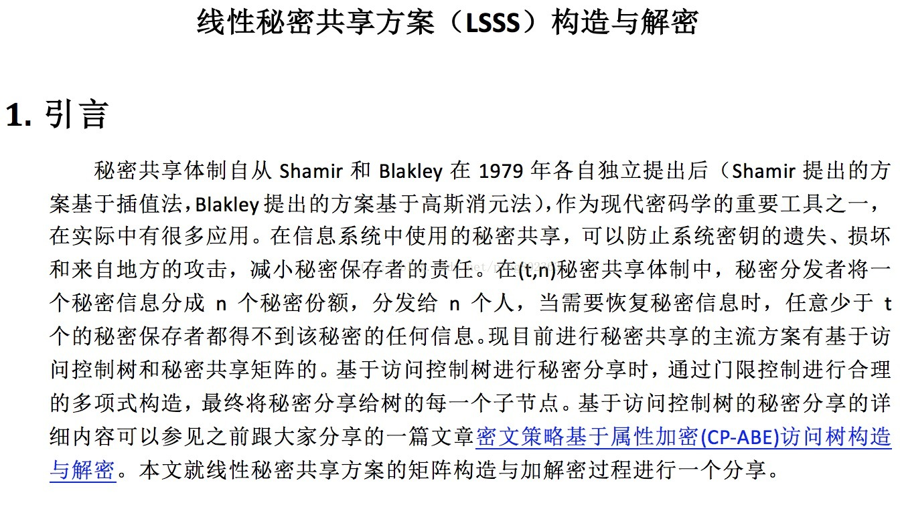
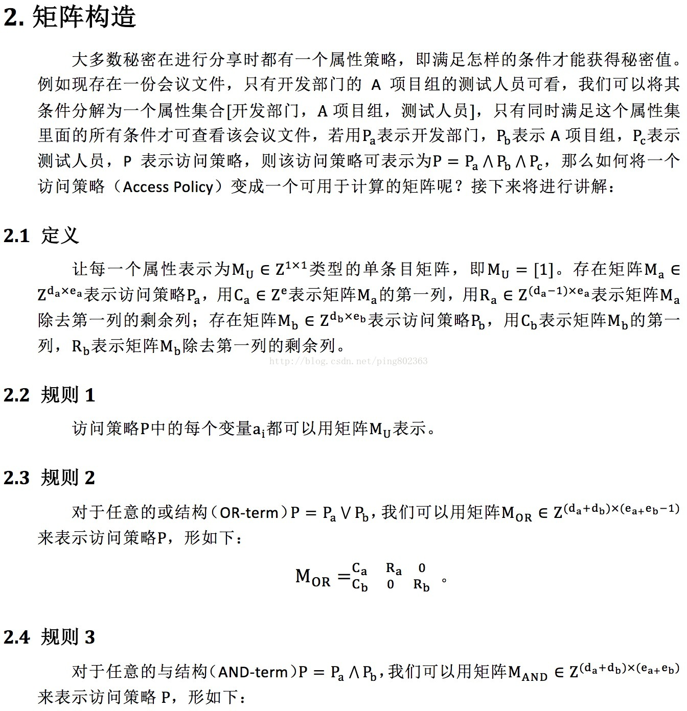
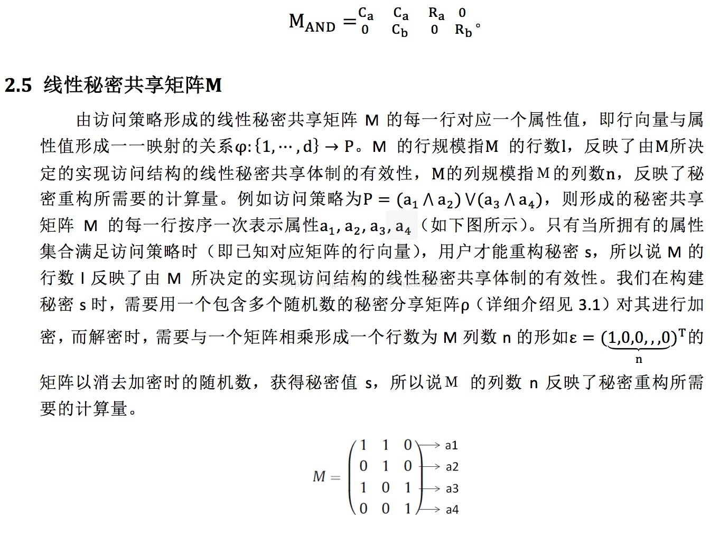
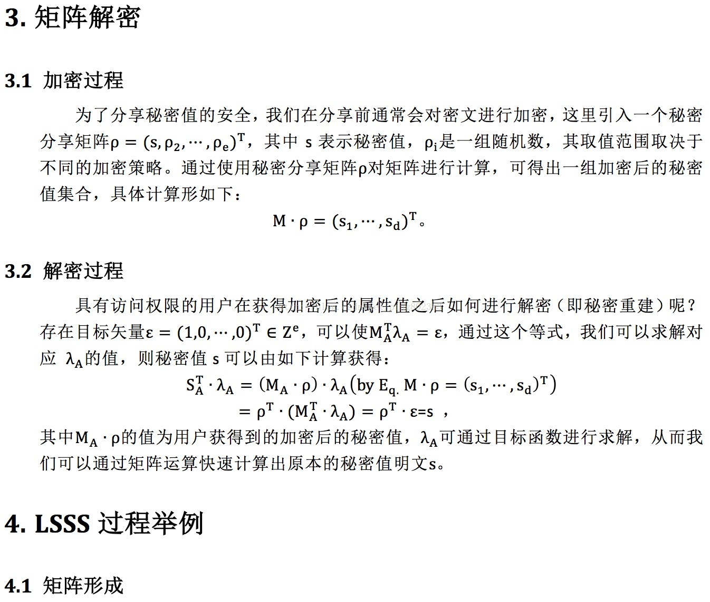
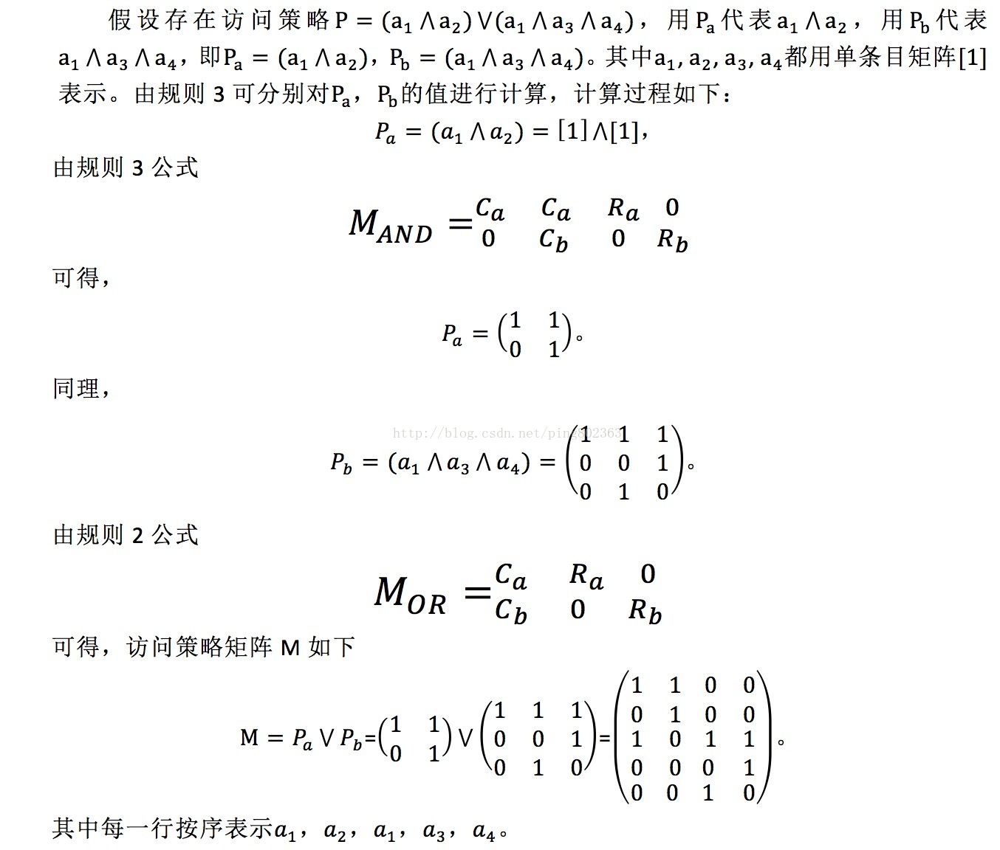
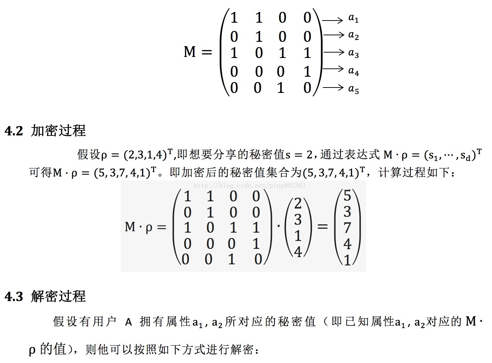
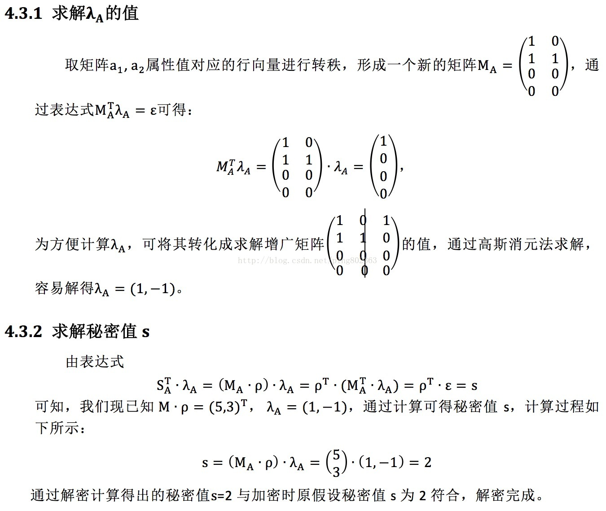

线性秘密共享方案（LSSS）构造与解密:

ABE中$Z_p$的理解： $Z_p$ is the collection of congruence classes when you divide by $p$. 

​	背景知识：数学上，同余（英语：congruence modulo，符号：≡）是数论中的一种等价关系。当两个整数除以同一个正整数，若得相同余数，则二整数同余。同余是抽象代数中的同余关系的原型。最先引用同余的概念与“≡”符号者为德国数学家高斯。由对于模n同余的所有整数组成的这个集合称为同余类（congruence class或residue class）。[具体介绍](https://baike.baidu.com/item/同余类/1432617?fr=aladdin)

