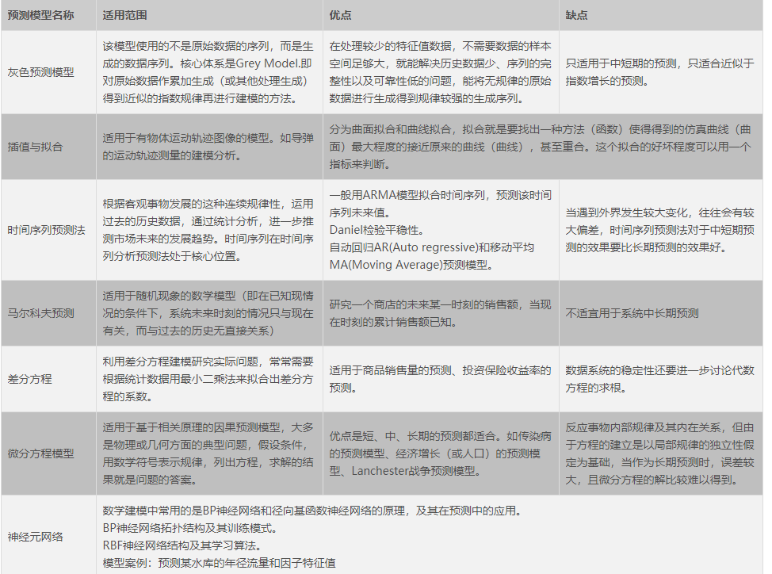

1.灰色预测模型GM(1,1)和GM(1,n)

​	理论是色预测理论模型：将已知的数据序列按照某种规则构成动态或静态的白色模块，再按照某种变化、解法来求解未来的灰色模型。

​	灰色系统的定义：灰色系统指既含有已知信息又含有未知信息的系统。
​	灰色预测模型的定义：对灰色系统进行预测的模型。灰色模型（Grey Model，简称GM模型）一般表达方式为GM（n,x）模型，其含义是：用n阶微分方程对x个变量建立模型。
​	灰色预测模型的目的：通过把分散在时间轴上的离散数据看成一组连续变化的序列，采用累加和累减的方式，将灰色系统中的未知因素弱化，强化已知因素的影响程度，最后构建一个以时间为变量的连续微分方程，通过数学方法确定方程中的参数，从而实现预测目的。
​	灰色系统预测模型的特点：无需**大量**数据样本，短期预测效果好，运算过程简单。
​	灰色系统预测模型的不足：对**非线性数据样本预测效果差**。

​	常用的灰色系统预测模型主要有GM(1,1)和GM(1,n)，以下分别对这两种模型展开

* GM（1,1）模型的预测原理是：对某一数据序列用累加的方式生成一组趋势明显的新数据序列，按照新的数据序列的增长趋势建立模型进行预测，然后再用累减的方法进行逆向计算，恢复原始数据序列，进而得到预测结果。

* GM（1,n）模型的预测原理：与GM(1,1)类似，不同在于输入数据变量是n个。

  编程实现：https://blog.csdn.net/wuli_dear_wang/article/details/80587650

2. 强化学习

Q-learning

3. RNN

LSTM

​	4.微分方程法：基于相关原理的因果预测；一般难以得到；由于方程的建立是以局部规律的独立性假定为基础，中长期预测偏差较大

​	5.时间序列法：趋势变化、周期性变化、随机性变化；常用模型：ARMA模型

​	6.组合预测模型：等全组合、不等权组合，能够综合利用各种方法所提供的信息，尽可能地提高预测精度

​	7.卡尔曼滤波预测模型：以最小均方误差为估计的最佳准则，来寻求一套递推估计的模型，其基本思想是： 采用信号与噪声的状态空间模型，利用前一时刻地估计值和现时刻的观测值来更新对状态变量的估计，求出现时刻的估计值。 

​	8.马尔科夫

**时间序列模型**

1）朴素估计：使用最后一个时间点的值估测后面一段时间段的值。

2）简单平均：

3）滑动窗口平均：使用之前一定大小时间段的平均值作为这个时间点的值

4）简单指数平均：

5）Holt’s线性趋势方法

6）Holt-winters 方法

7）Arima方法

8）PROPHET 方法：Facebook提出的一种方法，与Holt-winters类似，主要想法是"
时间序列的分解（Decomposition of Time Series），即把时间序列分成几个部分，分别是季节项 ，趋势项 ，剩余项，与Holt-winters方法类似 。

**其他总结：**

增长预测模型：集合模型方法、时间序列模型（指数平滑、ARMA，ARIMA，VAR，TAR，ARCH）、S型曲线（Logistic 模型）、灰色预测模型

Comperta模型原理与历史经验