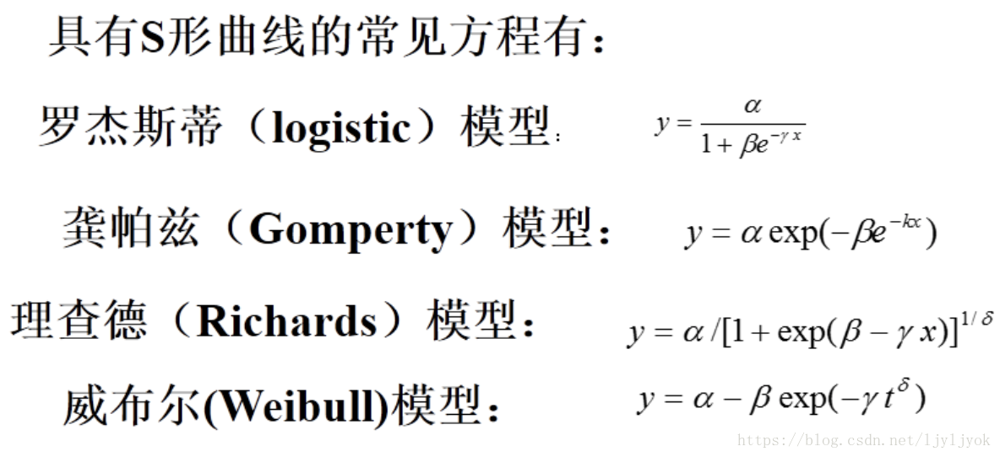

数学建模：分类-聚类-评价-预测

数学拟合：MATLAB cftool工具，[方法](https://blog.csdn.net/laobai1015/article/details/77537145)；人工预测，[方法](https://blog.csdn.net/ljyljyok/article/details/81624496)，常见模型：

**1 分类模型**
1判别分析
判别分析语聚类分析的区别：判别分析是已知若干类型，和一些样本的观测数据，再将未知的类型进行分类。
聚类分析不知道要分的类型，通过局内分析得到类型
1.1距离判别法：距离判别法
基本思想：首先根据已知分类的数据，分别计算各类的重心即分组(类)的均值，判别准则是对任给的一次观测，若它与第类的重心距离最近，就认为它来自第类。
至于距离的测定，可以根据实际需要采用欧氏距离、马氏距离、明科夫距离等。

**2 聚类模型：**

2.1系统聚类：

基本思想：开始将每个样本自成一类，然后求两两之间的距离。将距离最近的一类分成一类。如此重复，直到所有样本都合为一类为止。

适用范围：既适用于样本聚类，也适用于变量聚类。并且距离分类准则和距离计算方法都有多种，可以依据具体情形选择。可以用spss实现。

2.2快速聚类：

基本思想：按照指定分类数目，选择个初始聚类中心；计算每个观测量（样本）到各个聚类中心的距离，按照就近原则将其分别分到放入各类中；重新计算聚类中心，继续以上步骤；满足停止条件时（如最大迭代次数等）则停止。

使用范围：要求用户给定分类数目，只适用于样本聚类（Q型），不适用于变量聚类（R型）。

2.3两步聚类

先进行预聚类，在正式聚类、

使用范围：适用于超大样本聚类，海量数据或是有复杂结构的数据聚类

**3 评价模型**

3.1层次分析法

基本思想：是定性与定量相结合的多准则决策、评价方法。将决策的有关元素分解成目标层、准则层和方案层，并通过人们的判断对决策方案的优劣进行排序，在此基础上进行定性和定量分析。它把人的思维过程层次化、数量化，并用数学为分析、决策、评价、预报和控制提供定量的依据。
基本步骤：构建层次结构模型；构建成对比较矩阵；层次单排序及一致性检验（即判断主观构建的成对比较矩阵在整体上是否有较好的一致性）；层次总排序及一致性检验（检验层次之间的一致性）。
优点：它完全依靠主观评价做出方案的优劣排序，所需数据量少，决策花费的时间很短。从整体上看，AHP在复杂决策过程中引入定量分析，并充分利用决策者在两两比较中给出的偏好信息进行分析与决策支持，既有效地吸收了定性分析的结果，又发挥了定量分析的优势，从而使决策过程具有很强的条理性和科学性，特别适合在社会经济系统的决策分析中使用。
缺点：用AHP进行决策主观成分很大。当决策者的判断过多地受其主观偏好影响，而产生某种对客观规律的歪曲时，AHP的结果显然就靠不住了。
适用范围：尤其适合于人的定性判断起重要作用的、对决策结果难于直接准确计量的场合。要使AHP的决策结论尽可能符合客观规律，决策者必须对所面临的问题有比较深入和全面的认识。另外，当遇到因素众多，规模较大的评价问题时，该模型容易出现问题，它要求评价者对问题的本质、包含的要素及其相互之间的逻辑关系能掌握得十分透彻，否则评价结果就不可靠和准确。
改进方法：
(1) 成对比较矩阵可以采用德尔菲法获得。
(2) 如果评价指标个数过多（一般超过9个），利用层次分析法所得到的权重就有一定的偏差，继而组合评价模型的结果就不再可靠。可以根据评价对象的实际情况和特点，利用一定的方法，将各原始指标分层和归类，使得每层各类中的指标数少于9个。

3.2 灰色综合评价法（灰色关联度分析）

基本思想：灰色关联分析的实质就是，可利用各方案与最优方案之间关联度大小对评价对象进行比较、排序。关联度越大，说明比较序列与参考序列变化的态势越一致，反之，变化态势则相悖。由此可得出评价结果。
基本步骤：建立原始指标矩阵；确定最优指标序列；进行指标标准化或无量纲化处理；求差序列、最大差和最小差；计算关联系数；计算关联度。
优点：是一种评价具有大量未知信息的系统的有效模型，是定性分析和定量分析相结合的综合评价模型，该模型可以较好地解决评价指标难以准确量化和统计的问题，可以排除人为因素带来的影响，使评价结果更加客观准确。整个计算过程简单，通俗易懂，易于为人们所掌握;数据不必进行归一化处理，可用原始数据进行直接计算，可靠性强；评价指标体系可以根据具体情况增减；无需大量样本，只要有代表性的少量样本即可。
缺点：要求样本数据且具有时间序列特性；只是对评判对象的优劣做出鉴别，并不反映绝对水平，故基于灰色关联分析综合评价具有“相对评价”的全部缺点。
适用范围：对样本量没有严格要求，不要求服从任何分布，适合只有少量观测数据的问题；应用该种方法进行评价时，指标体系及权重分配是一个关键的问题，选择的恰当与否直接影响最终评价结果。
改进方法：
(1) 采用组合赋权法：根据客观赋权法和主观赋权法综合而得权系数。
(2) 结合TOPSIS法：不仅关注序列与正理想序列的关联度，而且关注序列与负理想序列的关联度，依据公式计算最后的关联度。

3.3 模糊综合评价法

基本思想：是以模糊数学为基础，应用模糊关系合成的原理，将一些边界不清、不易定量的因素定量化，从多个因素对被评价事物隶属等级（或称为评语集）状况进行综合性评价的一种方法。综合评判对评判对象的全体，根据所给的条件，给每个对象赋予一个非负实数评判指标，再据此排序择优。
基本步骤：确定因素集、评语集；构造模糊关系矩阵；确定指标权重；进行模糊合成和做出评价。
优点：:数学模型简单，容易掌握，对多因素、多层次的复杂问题评判效果较好。模糊评判模型不仅可对评价对象按综合分值的大小进行评价和排序，而且还可根据模糊评价集上的值按最大隶属度原则去评定对象所属的等级，结果包含的信息量丰富。评判逐对进行，对被评对象有唯一的评价值，不受被评价对象所处对象集合的影响。接近于东方人的思维习惯和描述方法，因此它更适用于对社会经济系统问题进行评价。
缺点：并不能解决评价指标间相关造成的评价信息重复问题，隶属函数的确定还没有系统的方法，而且合成的算法也有待进一步探讨。其评价过程大量运用了人的主观判断，由于各因素权重的确定带有一定的主观性，因此，总的来说，模糊综合评判是一种基于主观信息的综合评价方法。
应用范围：广泛地应用于经济管理等领域。综合评价结果的可靠性和准确性依赖于合理选取因素、因素的权重分配和综合评价的合成算子等。
改进方法：
(1) 采用组合赋权法：根据客观赋权法和主观赋权法综合而得权系数。

3.4 BP神经网络综合评价法

基本思想：是一种交互式的评价方法，它可以根据用户期望的输出不断修改指标的权值，直到用户满意为止。因此，一般来说，人工神经网络评价方法得到的结果会更符合实际情况。
优点：神经网络具有自适应能力，能对多指标综合评价问题给出一个客观评价，这对于弱化权重确定中的人为因素是十分有益的。在以前的评价方法中，传统的权重设计带有很大的模糊性，同时权重确定中人为因素影响也很大。随着时间、空间的推移，各指标对其对应问题的影响程度也可能发生变化，确定的初始权重不一定符合实际情况。再者，考虑到整个分析评价是一个复杂的非线性大系统，必须建立权重的学习机制，这些方面正是人工神经网络的优势所在。针对综合评价建模过程中变量选取方法的局限性，采用神经网络原理可对变量进行贡献分析，进而剔除影响不显著和不重要的因素，以建立简化模型，可以避免主观因素对变量选取的干扰。
缺点： ANN在应用中遇到的最大问题是不能提供解析表达式，权值不能解释为一种回归系数，也不能用来分析因果关系，目前还不能从理论上或从实际出发来解释ANN的权值的意义。需要大量的训练样本，精度不高，应用范围是有限的。最大的应用障碍是评价算法的复杂性，人们只能借助计算机进行处理，而这方面的商品化软件还不够成熟。
适用范围：神经网络评价模型具有自适应能力、可容错性，能够处理非线性、非局域性的大型复杂系统。在对学习样本训练中，无需考虑输入因子之间的权系数，ANN通过输入值与期望值之间的误差比较，沿原连接权自动地进行调节和适应，因此该方法体现了因子之间的相互作用。
改进方法：
(1) 采用组合评价法：对用其它评价方法得出的结果，选取一部分作为训练样本，一部分作为待测样本进行检验，如此对神经网络进行训练，知道满足要求为止，可得到更好的效果。

3.5 数据包络法(DEA)

3.6 组合评价法

**4 预测模型**
定性研究与定量研究的结合，是科学的预测的发展趋势。在实际预测工作中，应该将定性预测和定量预测结合起来使用，即在对系统做出正确分析的基础上，根据定量预测得出的量化指标，对系统未来走势做出判断。

4.1 回归分析法

基本思想：根据历史数据的变化规律，寻找自变量与因变量之间的回归方程式，确定模型参数，据此预测。回归问题分为一元和多元回归、线性和非线性回归。
特点：技术比较成熟，预测过程简单；将预测对象的影响因素分解，考察各因素的变化情况，从而估计预测对象未来的数量状态；回归模型误差较大，外推特性差。
适用范围：回归分析法一般适用于中期预测。回归分析法要求样本量大且要求样本有较好的分布规律，当预测的长度大于占有的原始数据长度时，采用该方法进行预测在理论上不能保证预测结果的精度。另外，可能出现量化结果与定性分析结果不符的现象，有时难以找到合适的回归方程类型。

4.2 时间序列分析法

基本思想：把预测对象的历史数据按一定的时间间隔进行排列，构成一个随时间变化的统计序列，建立相应的数据随时间变化的变化模型，并将该模型外推到未来进行预测。
适用范围：此方法有效的前提是过去的发展模式会延续到未来，因而这种方法对短期预测效果比较好，而不适合作中长期预测。一般来说，若影响预测对象变化各因素不发生突变，利用时间序列分析方法能得到较好的预测结果；若这些因素发生突变，时间序列法的预测结果将受到一定的影响。

4.3 灰色预测法

基本思想：将一切随机变量看作是在一定范围内变化的灰色变量，不是从统计规律角度出发进行大样本分析研究，而是利用数据处理方法(数据生成与还原)，将杂乱无章的原始数据整理成规律性较强的生成数据来加以研究，即灰色系统理论建立的不是原始数据模型，而是生成数据模型。
适用范围：预测模型是一个指数函数，如果待测量是以某一指数规律发展的，则可望得到较高精度的预测结果。影响模型预测精度及其适应性的关键因素，是模型中背景值的构造及预测公式中初值的选取。

4.4 BP神经网络法

人工神经网络的理论有表示任意非线性关系和学习等的能力，给解决很多具有复杂的不确定性和时变性的实际问题提供了新思想和新方法。
利用人工神经网络的学习功能，用大量样本对神经元网络进行训练，调整其连接权值和闭值，然后可以利用已确定的模型进行预测。神经网络能从数据样本中自动地学习以前的经验而无需繁复的查询和表述过程，并自动地逼近那些最佳刻画了样本数据规律的函数，而不论这些函数具有怎样的形式，且所考虑的系统表现的函数形式越复杂，神经网络这种特性的作用就越明显。
误差反向传播算法(BP算法)的基本思想是通过网络误差的反向传播，调整和修改网络的连接权值和闭值，使误差达到最小，其学习过程包括前向计算和误差反向传播。它利用一个简单的三层人工神经网络模型，就能实现从输入到输出之间任何复杂的非线性映射关系。目前，神经网络模型已成功地应用于许多领域，诸如经济预测、财政分析、贷款抵押评估和破产预测等许多经济领域。
优点：可以在不同程度和层次上模仿人脑神经系统的结构及信息处理和检索等功能，对大量非结构性、非精确性规律具有极强的自适应功能，具有信息记忆、自主学习、知识推理和优化计算等特点，其自学习和自适应功能是常规算法和专家系统技术所不具备的，同时在一定程度上克服了由于随机性和非定量因素而难以用数学公式严密表达的困难。
缺点：网络结构确定困难，同时要求有足够多的历史数据，样本选择困难，算法复杂，容易陷入局部极小点。

4.5 支持向量机法

支持向量机是基于统计学习的机器学习方法，通过寻求结构风险化最小，实现经验风险和置信范围的最小，从而达到在统计样本较少的情况下，亦能获得良好统计规律的目的。
其中支持向量机是统计学习理论的核心和重点。支持向量机是结构风险最小化原理的近似，它能够提高学习机的泛化能力，既能够由有限的训练样本得到小的误差，又能够保证对独立的测试集仍保持小的误差，而且支持向量机算法是一个凸优化问题，因此局部最优解一定是全局最优解，支持向量机就克服了神经网络收敛速度慢和局部极小点等缺陷。
核函数的选取在SVM方法中是一个较为困难的问题，至今没有一定的理论方面的指导。

4.6 组合预测法

在实际预测工作中，从信息利用的角度来说，就是任何一种单一预测方法都只利用了部分有用信息，同时也抛弃了其它有用的信息。为了充分发挥各预测模型的优势，对于同一预测问题，往往可以采用多种预测方法进行预测。不同的预测方法往往能提供不同的有用信息，组合预测将不同预测模型按一定方式进行综合。根据组合定理，各种预测方法通过组合可以尽可能利用全部的信息，尽可能地提高预测精度，达到改善预测性能的目的。
优化组合预测有两类概念，一是指将几种预测方法所得的预测结果，选取适当的权重进行加权平均的一种预测方法，其关键是确定各个单项预测方法的加权系数；二是指在几种预测方法中进行比较，选择拟合度最佳或标准离差最小的预测模型作为最优模型进行预测。组合预测是在单个预测模型不能完全正确地描述预测量的变化规律时发挥其作用的。

Gold, Silver, and Bronze 客户类型(按照价值高低分类)